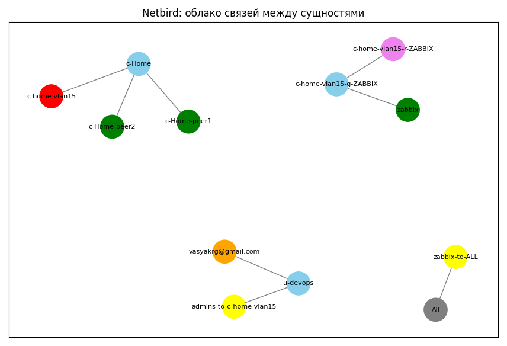

# NetBird API IaC

## Требования

- Python 3.8+
- requests
- pyyaml
- python-dotenv

## Быстрый старт

1. Установите Python 3.8+ (<https://www.python.org/downloads/>)
2. Клонируйте репозиторий и перейдите в папку проекта:

   ```bash
   git clone <repo_url>
   cd <project_dir>
   ```

3. Установите зависимости:

   ```bash
   python3 -m venv venv
   source venv/bin/activate
   pip install -r requirements.txt
   ```

4. Скопируйте .env.example в .env и укажите параметры подключения:

   ```bash
   cp .env.example .env
   ```

5. Создайте папки peers, groups, policies, networks, dns (если не созданы):

   ```bash
   mkdir -p peers groups policies networks dns
   ```

6. Положите yaml-файлы с описанием сущностей в соответствующие папки.
7. Запустите скрипт:

   ```bash
   python3 netbird_linter.py && python3 netbird_configurator.py
   ```

## Выбор этапа выполнения

Скрипт поддерживает аргумент `--tag` для запуска только нужного этапа. По умолчанию выполняются все этапы (`all`).

Доступные теги:

- all
- groups
- users
- dns
- networks
- resources
- routes
- policy
- cleanup (чистит сети, ресурсы и роуты)

Пример запуска только этапа синхронизации групп:

```bash
python3 netbird_configurator.py --tag groups
```

## Структура конфигов

- Старайтесь в каждом yaml-файле описывать одну сущность NetBird (peer, group, policy, network, dns).
- Названия файлов в группах resources\routes должно соответствовать названию сети из networks
- В groups\resources\policy - внутри файлов поддерживаются массивы

## Debug

- DEBUG=true в .env файле включает полный вывод применения по каждому объекту

## Линтер

- Проверяет дубликаты по ключевым полям (name/email) в groups, policy, users, dns
- Проверяет, что если в policy указана группа, то в соответствующей группе есть хотя бы один peer. Если peers нет — выводится warning
- Исключение: файл users.yaml не проверяется на группы без пиров в policy

## Визуализация связей



Для просмотра облака связей между группами, пользователями, ресурсами, роутами, политиками и пирами используйте скрипт:

```bash
python3 visualize_relations.py [--groups group1,group2,...] [--depth N] [--no-legend]
```

- `--groups` — список групп через запятую, чтобы визуализировать только выбранные группы и связанные с ними объекты. По умолчанию отображаются все группы.
- `--depth` — глубина связывания от выбранных групп (целое число). Например, 1 — только прямые связи, 2 — связи на два шага и т.д. По умолчанию — без ограничения (вся компонента).
- `--no-legend` — отключить отображение легенды по цветам узлов (по умолчанию легенда включена).

- Откроется интерактивное окно с графом связей.
- Можно перетаскивать узлы мышкой для удобства просмотра.
- Цвета узлов:
  - голубой — группы
  - оранжевый — пользователи
  - зелёный — пиры
  - фиолетовый — ресурсы
  - красный — роуты
  - жёлтый — политики
- В правом верхнем углу отображается легенда по цветам (можно отключить через `--no-legend`).

### Автор

- [Yegorov Vassiliy](https://egorovanet.ru)
- [IT-школа](https://realmanual.ru)
